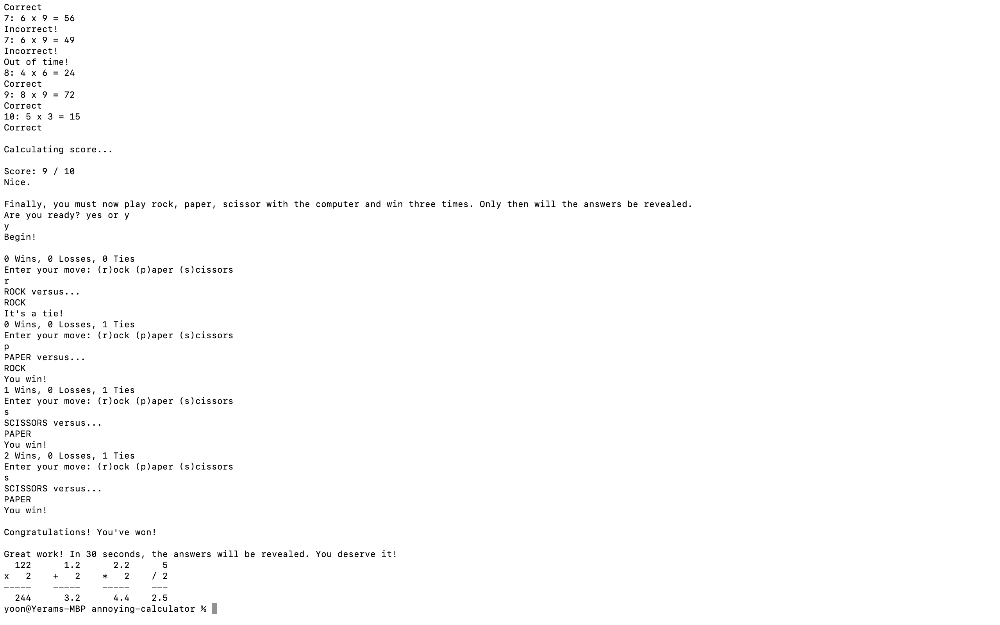

# Annoying Calculator



## Description
This is a Python function that solves simple arithmetic problems and returns the results in a vertically aligned format. The function comes with several annoying conditions:

- To reveal the answer, the user must guess a specific number

- Once the user guesses the correct number, the user must solve a series of multiplication problems

- Once the user solves the problems, the user must defeat the computer in a game of rock, paper, scissors

- Once the user wins the game, the answers to the arithmetic problems will be revealed

- Operations must be formated as strings inside an array

- Operands are limited to 4 digits

- The function can only solve up to 5 problems at a time

The purpose of this script was so that I could practice various aspects of the Python language.

## Requirements
This project utilizes the [PyInputPlus](https://pypi.org/project/PyInputPlus/) module.

```
$ pip install pyinputplus
```

## Usage
To make a calculation, pass a list of operations in string format inside the calculate() function. Print to the console.

```
calculate(['122 x 2', '1.2 + 2', '2.2 * 2', '5 / 2'])
```